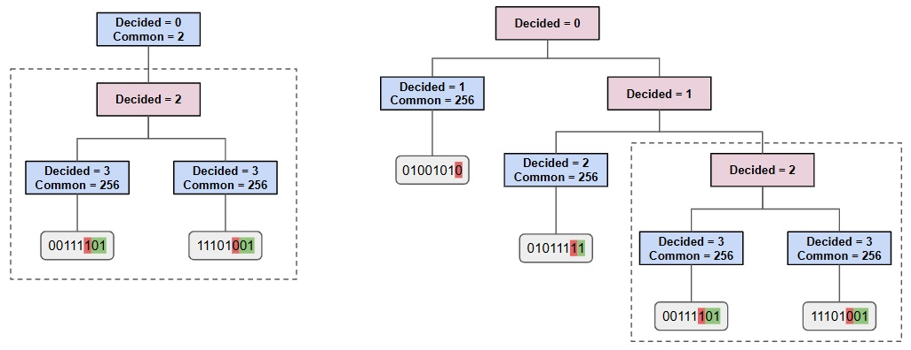
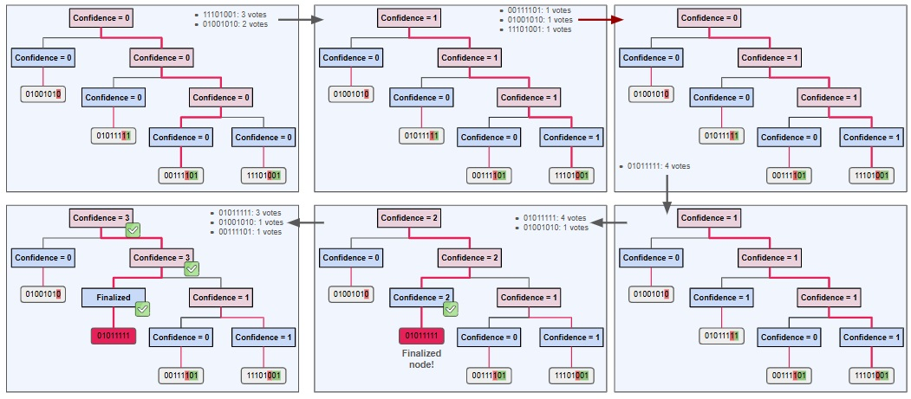

# avalanchego v.1.9.x

## Snowball Consensus Implementation

The Snowball consensus has two distinct implementations:

* `Flat` implementation: this is the naive implementation described the original whitepaper, which relies on repeated sampling of the network.
Votes are directly counted for each color, and decisions are independent of each other.
Practically, this is a direct wrapper of a `nnarySnowball` logic, which works as follows:
	1. Sample the network.
	2. Get current preferences from the sample.
	3. Update preference and confidence counter according to Snowball logic -- if new value becomes preference, confidence resets to 1.
	4. Repeat steps 1-3 until confidence reaches the `beta` parameter.
 
* `Tree` implementation: while the simple `Flat` implementation uses a repeated sampling to find a winning color in a set of possible choices, the `Tree` implementation extends this logic by allowing each color to be a node in a branching data structure. 
This uses modified Patricia tree, where each node has its own confidence counter, thus using a hierarchical structure.
Practically, the `Tree` implementation builds on the `unarySnowball` logic, using `unaryNodes` to manage preferences hierarchically.
Note that if a node's confidence reaches `beta`, the protocol prunes sibling branches and locks in that node's branch.
This process continues until a single branch is considered final.


Ultimately, the `Tree` Snowball implementation in `snowball/tree.go` is specialized to handle multi-branch conflicts elegantly by modeling them as a hierarchy rather than trying to track every color in a `Flat` structure.
This optimizes the process of merging/pruning and keeps the consensus process efficient.


## Setup

To test and visualize the `Tree` implementation, add the go scripts in `avalanchego/snow/consensus/snowball`, and run the test functions.

## Scripts

* `tree_utils.go`: contains additional functions for testing the `Tree` implementation of the Snowball protocol.
* `tree_visualization_test.go`: used for visualizing the `Tree` implementaion of the consensus protocol.
* `tree_poll_test.go`: used for testing differences between the `Flat` and `Tree` implementations, including number of rounds until consensus is reached.


# Tree Implementation


Snowball's `Tree` implementation uses a modified Patricia tree for deciding on competing blocks.
The tree structure is defined by the binary form of the 32-byte decisions (i.e. block hashes), as shown in the diagram below.


For a single decision, the tree consists of a single block.
When a competing decision is added, the tree branches into two separate directions.
At this point there is no much difference between the naive (`Flat`) implementation and the `Tree` implementation.
These differences become visible when more decisions are added.

<p align="center">
  
</p>


## Types of Nodes

Tree nodes can be either `unaryNode` or `binaryNode`.
As the name suggests, unary (binary) nodes run unary (binary) versions of the Snowball protocol, implemented in `unarySnowball.go` (and `binarySnowball.go`, respectively).
Each node of the tree tracks some additional parameters (see `tree.go` for more details).
For a `unaryNode`, we have:
* `Preference`: currently preferred decision
* `DecidedPrefix`: represents the index of the last bit in the prefix that has been decided (i.e., agreed upon by all nodes under this branch).
* `CommonPrefix`: represents the index of the last bit in the prefix that is shared by all nodes under this branch, even if undecided.

Meanwhile, for a `binaryNode`, we only keep track of preference and a version of `DecidedPrefix`: the index in the id of the choice the binary node is deciding on.

Nodes also track the confidence in the current preference.
For a `unaryNode`, the confidence tracks the number of successful polls in a row that have returned the current preference.
Meanwhile, for a `binaryNode`, the confidence is the choice with the largest number of successful polls, where ties are broken by switching choice lazily.


## Tree Structure

When adding a new decision, the tree splits at the first differing bit beyond the `DecidedPrefix`.
This is done using the `FirstDifferenceSubset()` method, defined within `avalanchego/ids/bits.go`.
Note that the counting is done from the most significant bit (MSB) to the least significant bit (LSB) within a byte.
Namely, bit indices are defined as:

[7 6 5 4 3 2 1 0] [15 14 13 12 11 10 9 8] ... [255 254 253 252 251 250 249 248]

where index 7 is the MSB of byte 0.

Now, as poll results come in, the preferences of the nodes can change, as shown in the example below.
Here, we use the following parameters for the Snowball protocol:

```
        K:            5,
        Alpha:        3,
        BetaVirtuous: 2,
        BetaRogue:    3
```

<p align="center">
  
</p>


# Consensus Tests

For testing the Snowball implementation, a dummy network is defined in `avalanchego/snow/consensus/snowball/network_test.go`.
This `Network` struct allows one to add nodes with initial preferences, and simulates the consensus by running rounds (`Round()`) where a non-finalized node is randomly selected to perform an unbiased poll of the nodes in the network.
Nodes are added with one of the following methods:

* `AddNode()`: the initial preference is randomly set to one of the colors set during the initialization of the `Network`.
* `AddNodeSpecificColor()`: this method allows specific initial preferences.

Note also that one can also add `Byzantine` nodes -- as nodes that have a hardcoded preference -- using `AddNodeSpecificColor(&Byzantine{})`, as in `consensus_reversibility_test.go`.
These are finalized nodes which will not change their preference.

